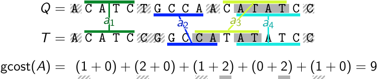
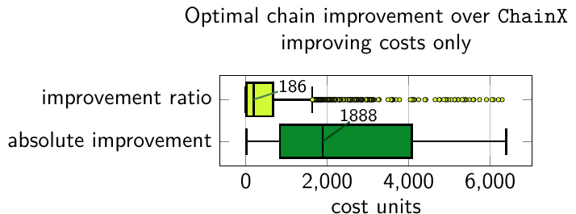

# ChainX


Fork of [at-cg/ChainX](https://github.com/at-cg/ChainX), a tool that computes co-linear chaining costs between an input target and query sequences. It supports global and semi-global comparison modes. The new features in this fork are:
 - optimal chaining (with option `--optimal`), since ChainX can output a suboptimal chain in a small number of edge cases;
 - non-constant magic numbers to minimize the iterations of the chaining algorithm (the original behaviour can be restored with `--originalmagicnumbers`).

## Dependencies / External libraries
ChainX repository uses many third-party libraries. These are separately provided in [ext](ext) folder. 

- A C++ compiler with c++11 support, e.g., GNU g++ (version 5+)
- [essaMEM](https://doi.org/10.1093/bioinformatics/btt042)
- [libdivsufsort](https://github.com/y-256/libdivsufsort)
- [MUMmer](https://github.com/mummer4/mummer)
- [edlib](https://github.com/Martinsos/edlib)
- [clipp](https://github.com/muellan/clipp)
- [cxx-prettyprint](https://github.com/louisdx/cxx-prettyprint)
- [kseq](https://github.com/lh3/seqtk)

Additionally, the [experimental tests](data) requires awk, wget, [seqtk](https://github.com/lh3/seqtk), and [GNU octave](https://octave.org/).

## Installation
```sh
git clone https://github.com/nrizzo/ChainX.git
cd ChainX
make
```

## Usage
```
SYNOPSIS
        ./chainX [-l <length>] [-a (MEM|MUM)] [--all2all] [--naive] [--optimal]
                 [--originalmagicnumbers] -m (g|sg) -q <qpath> -t <tpath>

OPTIONS
        <length>    minimum anchor match length (default = 20)
        MEM|MUM     anchor type (default = MUM)
        --all2all   output all to all global distances among query sequences in phylip format
        --naive     use slow 2d dynamic programming algorithm for correctness check
        --optimal   compute optimal chain by using diagonal distance
        --originalmagicnumbers
                    use original magic numbers instead of inverse query coverage times 1.5 and
                    ramp-up factor of 4

        g|sg        distance function (e.g., global or semi-global)
        <qpath>     query sequences in fasta or fastq format
        <tpath>     target sequence in fasta format
```

## Example
Test data can be accessed from [data](data) folder. Here is an example run.

```
$ ./chainX -m g -q data/time_global/mutated_80_perc.fasta -t data/time_global/Chromosome_2890043_3890042_0.fasta --optimal
INFO, chainx::parseandSave, target sequence file = data/time_global/Chromosome_2890043_3890042_0.fasta
INFO, chainx::parseandSave, query sequences file = data/time_global/mutated_80_perc.fasta
INFO, chainx::parseandSave, mode = g
INFO, chainx::parseandSave, computing optimal chain with diagonal distance
INFO, chainx::parseandSave, anchor : minimim length = 20, type = MUM
INFO, chainx::main, read 1 queries, 999760 residues
INFO, chainx::main, read target, 1000000 residues

INFO, chainx::main, timer set
INFO, chainx::main, suffix array computed in 0.137535 seconds

INFO, chainx::main, timer reset
INFO, chainx::main, count of anchors (including dummy) = 2964, average length = 24.0651
INFO, chainx::main, query #0 (999760 residues), (71302 coverage, 1392687 initial guess), distance = (1 iterations) 939635
INFO, chainx::main, distance computation finished (0.255348 seconds elapsed)
```

## Experiments
Command `make test`:
- replicates the ChainX experiments and compares the original algorithm (`--originalmagicnumbers`) to the new optimal version (`--originalmagicnumbers --optimal`) and the final optimal version (`--optimal`);
- runs ChainX and the final optimal version (`--optimal`) in semi-global mode on 100K PacBio HiFi reads on the on the T2T-CHM13 reference, requiring ~25GB of disk space and ~50GB of RAM.

In the experiment on human long reads, the optimal version has comparable speed to original ChainX and finds a better chain for 2.30% reads (more details in the paper).



## Publications
- **Chirag Jain, Daniel Gibney and Sharma Thankachan**. "[Algorithms for Colinear Chaining with Overlaps and Gap Costs](https://doi.org/10.1089/cmb.2022.0266)". *Journal of Computational Biology*, 2022.
- **Nicola Rizzo, Manuel Cáceres, and Veli Mäkinen**. "[Practical colinear chaining on sequences revisited](https://doi.org/10.1007/978-981-95-0695-8_17)" ([arXiv](https://doi.org/10.48550/arXiv.2506.11750)). *ISBRA 2025*.
